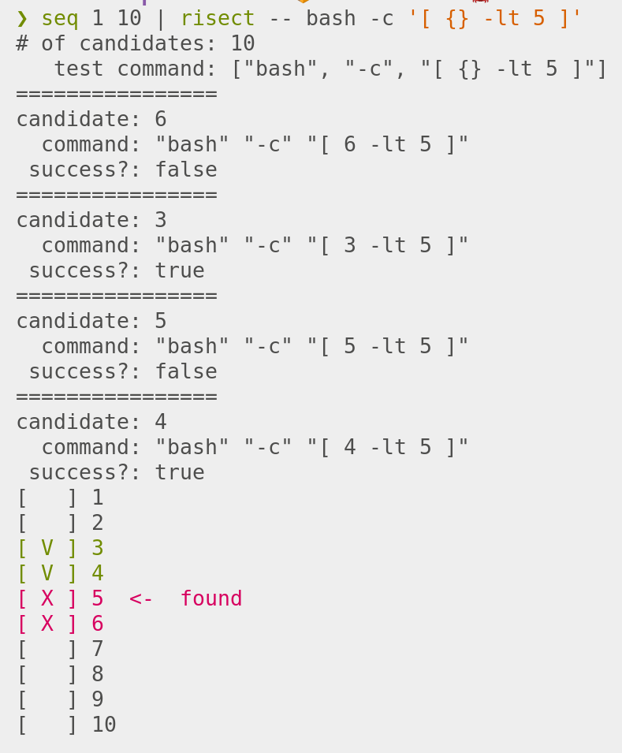

# Risect



Risect is a bisection tool, more friendly and general than `git bisect`.

## vs `git bisect`
- `git bisect` command set is hard to remember
- `git bisect` takes efforts to eye-parse its stdout
- `git bisect` cannot search commits of a dependency

## Usage

You can use Risect in two ways.
1. Pipe the search space to stdin
2. Use the built-in setup (recommended)

For example, to simulate `git bisect`, you can directly use `git rev-list` or `--git` flag.

```
1. git rev-list master~5 .. master | risect -- sh -c "git checkout {} && ./test.sh"
2. risect --git master~5 master --  sh -c "git checkout {} && ./test.sh"
```

The second methods provide more meta data in addition to `{}` such as `{author-name}` or `{author-email}`. These can be used in test commands and report formats.

## Configs (TODO)
- `--verbose`
- `--parallel <n>` runs (n+1)-ary search
- `--interactive`

## Built-in Types (TODO)

Git
```
risect --git --from HEAD~5 --to HEAD -- ./test.sh {}  # all commit hash list is determined before first run
risect --git --from HEAD~5 --to HEAD --path ./submodule -- ./test.sh {}  # git bisect on submodule
risect --git --from-date 2020-05-02 --to bbbb -- ./test.sh {}  # commits since --from-date
risect --git --from-date 2020-05-02 --n 5 -- ./test.sh {}  # 5 commits since --from-date
```

Dates

```
risect --date 2020-05-05 2020-05-20 -- ./test.sh {}
```

Numbers

```
seq 0 1.0 0.2 | risect -- ./test.sh --threshold={}
```

Custom

```
risect --custom "seq 0 1.0 0.2" -- ./test.sh --threshold={}
```


## report (TODO)

#### realtime progress1
```
        input: aaaaaa ... bbbbbb (50 candidates)
    remaining: aadaaa ... bbebbb (20 candidates)
 last success: dddddd
first failure: eeeeee
```

#### realtime progress2

```
[ ] 1
[ ] 2
[ ] 3
[ ] 4
[x] 5  <- last failure
[ ] 6
[?] 7  <- running
[ ] 8
[ ] 9
[ ] 10
..
[ ] 199
[v] 200  <- first success
```

#### barcode plot

```
|...o...o...oo.....?...x..x...|
```
